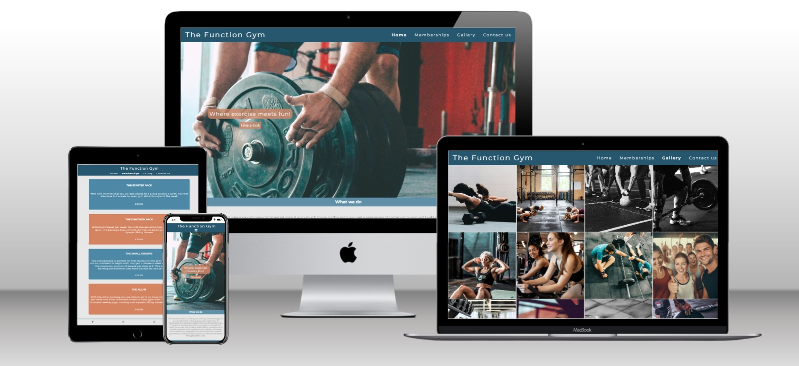
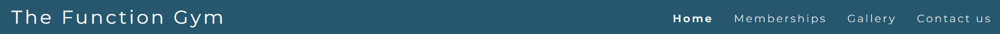
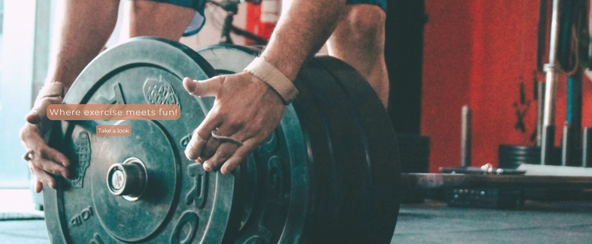
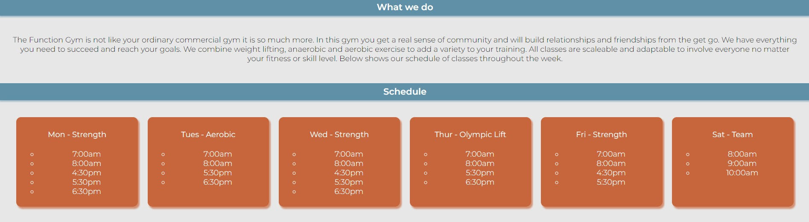
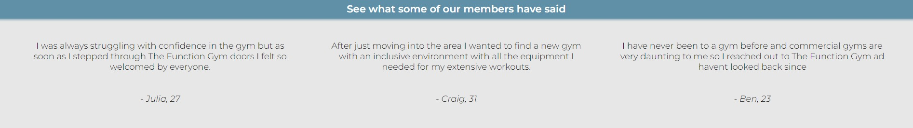
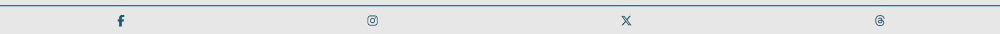
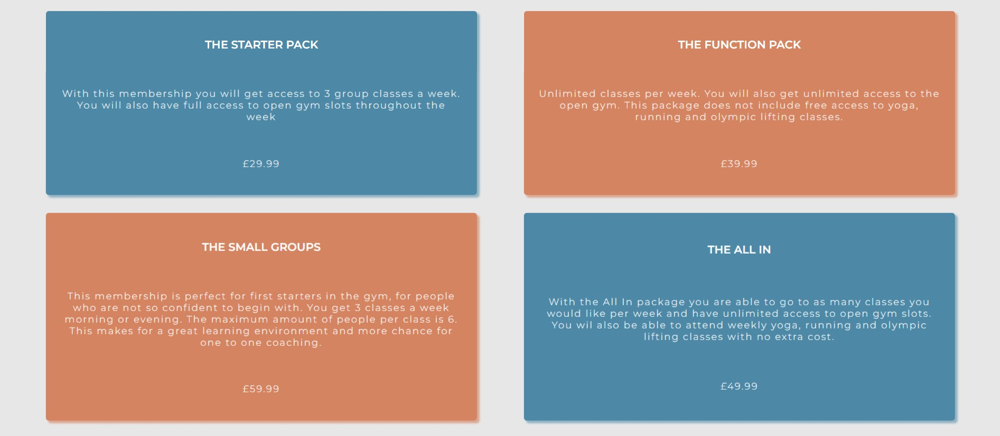
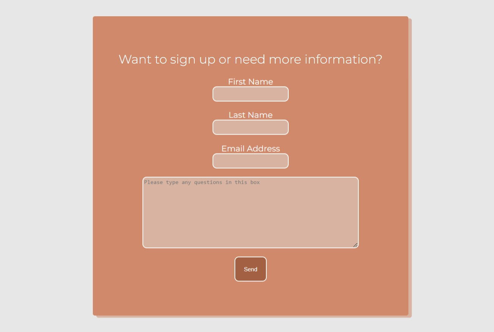

# The Function Gym

The purpose of this project is to provide information to people who are thinking of joining The Function Gym. This site is aimed at people who want to join a gym which has focus on fun and community but also working hard as well. It will provide information on different membership types and prices. There will also be a section for customers to submit questions if they need more information. 

## Features

  * __Navigation Bar__
    * The navigation bar includes the company title which will link to the home page if clicked on. It will also include a home link, about link, memberships link, gallery link, and a contact link.
    * The navigation bar will be present at the top of the page on all 4 different pages. 

* __Hero Image__
    * The hero image will be visible on the home page, it is there to make the page visibly appealing and inticing.
    * Over the hero image will be the gyms moto and also a sign up link which will take customers to the membership page. 

* __About__
  * This section will have information about the gym and what it does, types of training and also it will show a schedule for class times.

* __Testimonials__
    * The testimonial section is for current customer reviews explaining why they enjoy The Function Gym. To show the success and enjoyment current members have. 

* __Footer__
    * This will include links to all of The Function Gyms social media.  

* __Memberships__
    * This feature will include all of the different membership types available for new customers. It will offer detail about memberships and the different prices of each one.
  

* __Gallery__
   * The gallery will display different photos of the gym and also the exsisting members. With the purpose of showing the community and the enjoyment people have attending The Function Gym. 
  

  
* __Contact__
    * This will provide a form for people to fill in if they have any further questions they would like to ask. 

## User Experience UX 

## Site Goals

* __User Goals__
  * As a customer the goals for this website are to draw them into to joining the function gym.
  * The site should come across as vibrant and fun a representation of what the gym is.
  * There should be opportunity for the customer to read about what the gym does and its type of training.
  * Also plenty of information for the user to find out about the different membership types.

### First time visitors
* On the first visit they can find information about what the gym does, and also a schedule of typical class times througout the week. 
* They will also find reviews of the organisation.
* Finally they can find images of what the the people and gym looks like.

### Returning visitors
* A returning customer will be able to find out more information about the gym membership options.
* They will also be able to find a way of contacting the organisation through the contact form. 
* Also they will find links to social media at the bottom of each page.

### Design Choices
* Colour scheme
    * The main two colours being used are orange and blue, with an off white background #e7e7e7. Orange and blue were used as a vibrant colour to add brightness to the webpage and make it more eye catching.
* Typography
    * The font-family used for this website is Montserrat and sans-serif was set as the fall back font. Montserrat was used as it has a clean and stylish look.
* Imagery
    * The background image was used to add a proffessional look to the website. All images in the gallery were used to show a happy and hard working environment. 

### Wireframes

* All wireframes were created using Balsamiq wireframes, all designs for desktop, tablet and mobile are linked [here](documentation/wireframes/wireframes.pdf).

## Testing
* Navbar
    * Clicking on each navbar link takes the user to a different webpage. All nav links are working from each different webpage. The main logo works as a link to the homepage on each page as well. No errors found.
        * On a medium screen size the navbar links move underneath the main logo filling the width of the screen.
        * On a small screen the navbar links collapse into a dropdown menu which is opened when the user clicks on the icon.

* Hero image
    * Hero image is visible on all different website sizes, the one link in the hero image takes the user to the gallery. 
        * On smaller screens the hero text moves to the centre and is still fully visible. 

* About section
    * This section is fully visible on all screen sizes and is readable. The paragraph changes to the screen size and the schedule items move down to a different row if they do not fit the screen. 
        * On small screens the schedule items are all stacked on top of eachother. This makes it easier to read.

* Reviews 
    * On large screens the review items display alongside eachother.
        * On screens under 1200px will mean the items will stack on top of eachother for easier visibility.

* Footer 
    * The footer displays logos to four different social media sights, facebook, instagram, twitter and threads, when clicking on a logo the user is linked to the corrosponding webpage in a new tab. All links were tested in each webpage.

* Memberships 
    * There are four different memberships shown on the screen. All visible and readable at different screen sizes. 
        * On small screens the memberships stack on top of eachother fitting the screen.
  
* Gallery 
    * The gallery page shows different images all at the same size. On a large screen the images spread across four columns. 
        * On any screen under 1200px then the images span over two columns.

* Contact page 
    * The contact page contains a form, which requires a first name, last name and an email, the form can not be submitted unless these are inputed into the text input areas. There is also a text area for any quiestios the user may want to ask. The form changes size with the screen size and is fully visible in smaller screen sizes.

### Validator Testing

* <https://jigsaw.w3.org/css-validator/validator> used to check CSS, tests returned no errors.
* <https://validator.w3.org/nu/> used to check HTML on each webpage.
    * index.html returned no warnings
    * about.html returned no errors
    * memberships.html returned no errors
    * gallery.html returned no errors
    * contact.html returned no errors.

###  Bugs found

* One bug found along the way was that the hero-image was not loading into the github pages but was laading into the codeanywhere preview. This was because a relative path was used and not the correct path type, so assets/images/hero-image.jpg was changed to ../images/hero-image.jpg.
  
## Deployment 
* This site was deployed to github pages here are the steps:
    * In Github find the repository.
    * Then go to the repository settings tab.
    * In the code and automation section on the sidebar scroll down to pages.
    * in the pages section under the source select deploy from branch.
    * Then use the branch dropdown menu to select main instead of none.
    * Then select root in the dropdown tab next to main.
    * Once completed press save. 
    * The github pages link is here <https://samlarby.github.io/Milestone-Project-1/>

  
## Credits

## Picture credits
### Pictures from the gallery page and hero image are from these opensource websites

* <https://www.freepik.com/>, attributes include photomaster1305 and rawpixel.com
* <https://www.vecteezy.com/>, attributes include Yulia Gapeenko
* <https://unsplash.com/>, attributes include Danielle Cerullo, Victor Freitas, Hayley Kim Studio, Logan Weaver and Samuel Girven.
* <https://www.pexels.com/>, attributes include Victor Freitas
  

